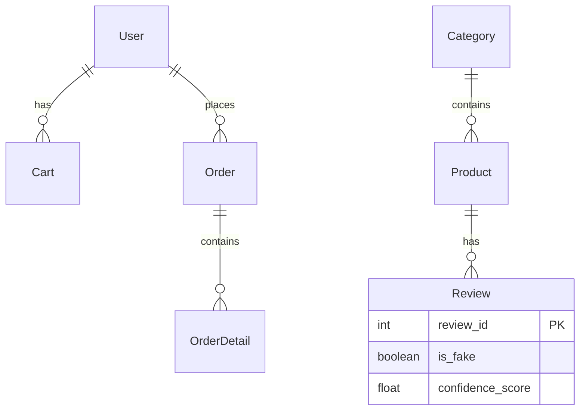

# E-Commerce Platform with AI Fake Review Detection 🚀

## Overview
Full-stack e-commerce application with Vietnamese language support and **AI-powered fake review detection**. 
Detects fake/spam reviews using SVM and fine-tuned BERT models with >95% accuracy on Vietnamese datasets.

**Backend**: Flask API + PostgreSQL + SocketIO realtime notifications
**Frontend**: React 19 + Vite + TailwindCSS + Recharts dashboard

## ✨ Features
### Customer
- Browse products by category
- Shopping cart & checkout (COD support)
- Submit reviews/ratings
- Order history & tracking
- User profile management

### Admin
- Dashboard with analytics (Recharts)
- Manage users, products, categories, orders
- **AI Review Moderation**: Auto-detect fake/irrelevant reviews with confidence scores
- Realtime notifications (SocketIO)

### AI Features
- **Fake Review Detection**: SVM + BERT/ONNX models
- Vietnamese-specific training data
- Labels reviews as `fake`, `irrelevant` with `confidence_score`
- Admin can hide/approve reviews

## 🛠 Tech Stack
```
Backend: Flask 3.0 | SQLAlchemy | PostgreSQL | JWT | SocketIO
AI/ML: PyTorch | Transformers | scikit-learn | ONNX
Frontend: React 19 | Vite | TailwindCSS | React Router | SocketIO-client
```

## 🚀 Quick Start

### Prerequisites
- Python 3.10+
- Node.js 20+
- PostgreSQL 15+ (create DB named `ecommerce_ai`)

### 1. Backend Setup
```bash
cd backend
pip install -r requirements.txt
cp .env.example .env  # Configure DATABASE_URL, JWT_SECRET_KEY
python run.py
```
Backend runs on `http://localhost:5000`

**Default Admin**: `admin` / `admin123`

### 2. Frontend Setup
```bash
cd frontend
npm install
npm run dev
```
Frontend runs on `http://localhost:5173`

### 3. AI Model Training (Optional)
```bash
cd backend/ai
# SVM Model
python train_svm.py
# BERT Model  
python train_bert.py
```

## 🌐 API Documentation
- `/api/docs` (Auto-generated Swagger if enabled)
- JWT Auth: `/auth/login`, `/auth/register`
- Products: `/products`, `/products/<id>`
- Reviews: `/reviews`, `/reviews/ai/analyze` (AI endpoint)

## 🗄 Database Schema


## 🤝 Contributing
1. Fork & clone
2. `black .` (format)
3. `flake8` (lint)
4. PR to `main`

## 📄 License
MIT
